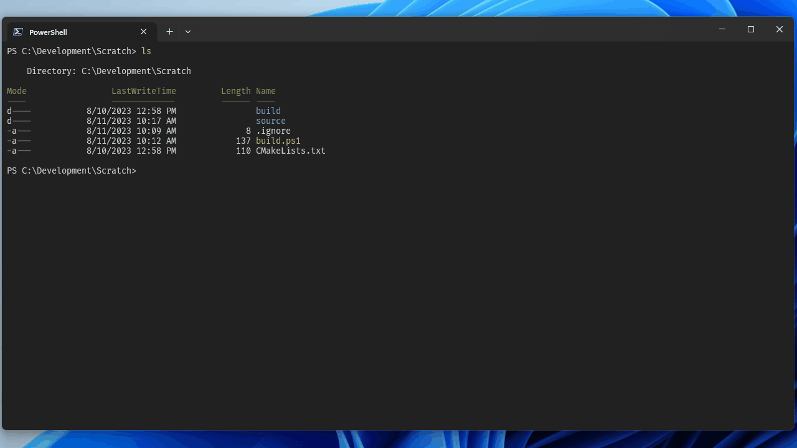

# Magic Trick's NVIM Configuration Setup

This is my personal Neovim init script. If you want to use this setup, clone it
somewhere accessible that you can `source` via absolute path.

### Using VimPlug

I use a plugin manager called VimPlug to fetch third-party plugins. You will need
to install it in order to make the plugins work. Depending on your platform, your
method of installation differs. The commands to install VimPlug are below:

Unix:
```
sh -c 'curl -fLo "${XDG_DATA_HOME:-$HOME/.local/share}"/nvim/site/autoload/plug.vim --create-dirs \
       https://raw.githubusercontent.com/junegunn/vim-plug/master/plug.vim'
```

Windows Powershell
```
iwr -useb https://raw.githubusercontent.com/junegunn/vim-plug/master/plug.vim |`
    ni "$(@($env:XDG_DATA_HOME, $env:LOCALAPPDATA)[$null -eq $env:XDG_DATA_HOME])/nvim-data/site/autoload/plug.vim" -Force
```

Once complete, you can execute `PlugInstall` within Neovim to retrieve the plugins.

### Custom Plugins

I will add my own custom plugins from time to time. Here is the short documentation of them.

**CJH** Compile-Jump-Helper:

    CJH is a utility that allows users to execute commands (particularly build scripts)
    and dumps them to a scratch buffer. From there, CJH provides a jump-to command which
    parses the current line a cursor is on and attempts to determine if it is a compiler
    error with a file location and line number/cursor location. It will then jump
    straight to that file for you.

    When you recompile, it will attempt to find an existing scratch buffer and dump
    to that rather than regenerating a new scratch buffer.

    This utility was designed for MSVC's error output, so g++/clang error output
    matching currently isn't tested/support.



### License

Free to use, modify, without warranty. It's just a config setup, nothing special.
Go wild.

